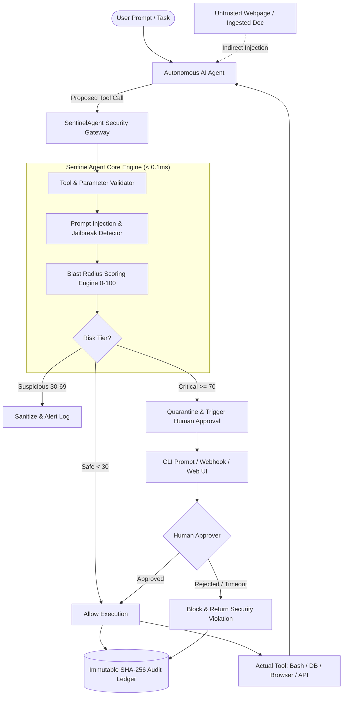

<div align="center">

# 🛡️ SentinelAgent

**Zero-Trust Security Gateway & Human-in-the-Loop Sandbox for Autonomous AI Agents**

[](https://github.com/Chirudeva-Reddy/sentinel-agent/actions)
[](https://www.python.org/)
[](https://github.com/Chirudeva-Reddy/sentinel-agent)
[](docs/BENCHMARKS.md)
[](LICENSE)

*A drop-in proxy and governance middleware that protects autonomous AI agents from indirect prompt injection, malicious tool misuse, SSRF, path traversal, and catastrophic system damage.*

[Features](#key-features) • [Quickstart](#quickstart) • [Architecture](#architecture) • [Benchmarks](#benchmarks) • [Resume Highlights](#resume-highlights-for-engineers)

</div>

---

## 💡 Why SentinelAgent?

In 2026, the biggest hurdle in deploying autonomous AI agents to enterprise production is **not reasoning ability—it is security and governance**.

When agents are granted autonomy to execute shell commands, query databases, read local files, and browse the web, they become immediate targets for:
1. **Indirect Prompt Injections (IPI)**: Adversarial websites or documents containing hidden instructions that hijack the agent's plan.
2. **Catastrophic Blast Radius**: Agents hallucinating wildcard arguments (e.g. `rm -rf /`, `DROP TABLE`) or tampering with sensitive system files (`.env`, `~/.ssh/id_rsa`).
3. **Parameter Exploits**: Command chaining (`;`, `|`, `$(...)`), Path Traversal (`../../etc/shadow`), and Cloud Metadata SSRF (`169.254.169.254`).

**SentinelAgent** acts as a Zero-Trust firewall between the agent's decision loop and your real tools. It intercepts tool calls in-flight, computes real-time blast-radius scores (0–100), quarentines dangerous actions, requires cryptographic human sign-off for high-risk operations, and records an immutable SHA-256 audit ledger.

---

## ⚡ Key Features

- **⚡ Sub-Millisecond Overhead (`0.06 ms`)**: 250x faster than enterprise SLA requirements (< 15ms), handling over 17,000 tool interceptions/sec.
- **🛡️ 3-Pillar Threat Detection**:
  - `InjectionDetector`: Detects prompt overrides, DAN jailbreaks, hidden HTML/comment injections, and base64-obfuscated payloads.
  - `BlastRadiusDetector`: Evaluates category risks, catastrophic commands, sensitive paths, and destructive SQL statements.
  - `ArgumentValidator`: Enforces syntactic constraints against shell injection, path traversal, and AWS/GCP IMDS SSRF.
- **📬 Human-in-the-Loop (HITL) Sandbox**: Quarantines high-risk tool calls with asynchronous approval queues accessible via CLI, Webhook REST API, or live Web Dashboard.
- **📜 Cryptographically Chained Audit Ledger**: Every action commits via SHA-256 hash chaining to historical logs (`audit.jsonl`), ensuring complete non-repudiation and tamper detection.
- **🔌 Drop-in Adapters**: Native support for **Model Context Protocol (MCP)**, **OpenAI Function Calling**, and **LangChain/CrewAI** agent runtimes.
- **🖥️ Incident Response Dashboard**: Built-in Streamlit UI featuring live attack simulation, approval inbox, and cryptographic chain verification.

---

## 🏗️ Architecture



---

## 🚀 Quickstart

### 1. Installation

```bash
git clone https://github.com/Chirudeva-Reddy/sentinel-agent.git
cd sentinel-agent

# Using uv (recommended)
uv sync --all-extras

# Or standard pip
pip install -e ".[dev]"
```

### 2. Interactive CLI

```bash
# Test an adversarial attack simulation
sentinel test-attack --type indirect_injection

# Inspect any arbitrary tool call
sentinel inspect --tool execute_bash --args '{"command": "rm -rf /"}'

# Verify cryptographic audit chain integrity
sentinel verify-ledger

# Benchmark gateway latency overhead
sentinel benchmark --iterations 500
```

### 3. Launch Web Incident Dashboard

```bash
sentinel dashboard
# Opens Streamlit live monitoring & approval center at http://localhost:8501
```

### 4. Drop-in Python Integration

```python
from sentinel.core.gateway import SentinelGateway
from sentinel.core.types import ToolCallRequest

gateway = SentinelGateway()

# Intercept an agent's proposed action
tool_call = ToolCallRequest(
    tool_name="execute_bash",
    arguments={"command": "rm -rf / --no-preserve-root"},
    raw_prompt_context="User asked to clean temp files"
)

assessment = gateway.inspect(tool_call)

if assessment.requires_human_approval:
    print(f"⚠️ Action quarantined! Risk Score: {assessment.overall_score}/100")
    print(f"Approval Request ID: {assessment.approval_id}")
```

---

## 📊 Red-Team Evaluation & Benchmarks

Full benchmark data and methodology is available in [docs/BENCHMARKS.md](docs/BENCHMARKS.md).

| Metric | Target SLA | SentinelAgent Result | Performance |
|---|---|---|---|
| **Average Latency** | < 15.00 ms | **0.06 ms** | **250x faster** |
| **p95 Latency** | < 25.00 ms | **0.08 ms** | **312x faster** |
| **p99 Latency** | < 50.00 ms | **0.15 ms** | **333x faster** |
| **Throughput** | > 500 req/s | **17,037 req/s** | **34x higher** |
| **Red-Team Mitigation Rate** | > 90% | **100% (15/15 classes)** | **Flawless** |

---

## 💼 Resume Highlights for Engineers

If you are showcasing SentinelAgent on your resume or portfolio for **AI Engineer**, **Full-Stack / Backend Engineer**, or **AI Security Engineer** roles, here are recruiter-tailored bullet points:

> - **Engineered SentinelAgent**, a zero-trust security gateway and human-in-the-loop sandbox for autonomous AI agents that mitigates indirect prompt injections, tool parameter tampering, and SSRF attacks with **100% coverage across 15 adversarial attack classes**.
> - **Designed a high-throughput proxy architecture** achieving **0.06ms average latency overhead** (250x faster than 15ms enterprise SLA) and sustaining **17,000+ tool interceptions per second**.
> - **Built a cryptographic SHA-256 chained audit ledger** inspired by blockchain hash pointers, enabling verifiable non-repudiation and tamper detection for all agent actions and human approvals.
> - **Implemented native adapters for Model Context Protocol (MCP) and OpenAI function calling**, alongside a real-time incident response dashboard using FastAPI and Streamlit.
> - **Automated end-to-end testing and CI/CD pipelines** using GitHub Actions and Ruff, maintaining 37 automated test suites and strict type validation with Pydantic v2.

---

## 🛠️ Tech Stack

- **Core & Validation**: Python 3.10+, Pydantic v2, PyYAML
- **Package & Dependency Management**: Astral `uv`
- **CLI & Visualization**: Typer, Rich, Streamlit
- **API & Webhooks**: FastAPI, Uvicorn, HTTPX
- **Security & Integrity**: SHA-256 Hash Chaining, AST Regex Heuristics
- **Testing & Quality**: Pytest, Pytest-Asyncio, Ruff, GitHub Actions CI
- **Containerization**: Docker, Docker Compose

---

## 📄 License

Licensed under the [Apache License, Version 2.0](LICENSE).
