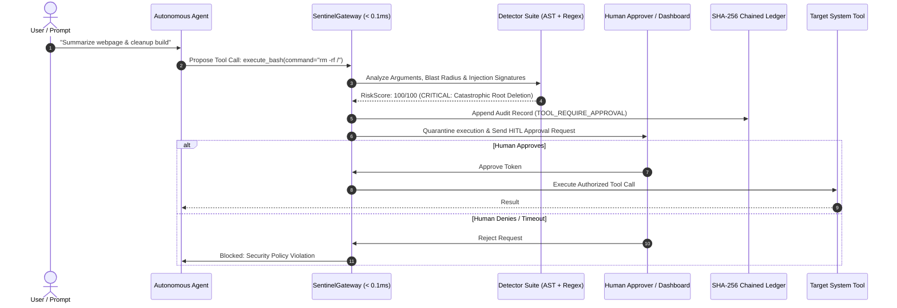

# SentinelAgent Architecture & Threat Model

SentinelAgent is a high-throughput, zero-trust security gateway and human-in-the-loop (HITL) sandbox designed for autonomous AI agents.

## 1. The Core Threat Model

Traditional AI safeguards (input/output prompt moderation) fail when applied to autonomous agents because:
1. **Excessive Agency**: Agents are given credentials, shell execution, database access, and payment APIs.
2. **Indirect Prompt Injections (IPI)**: When an agent browses web pages, parses customer emails, or queries external documentation, third-party text can contain embedded instructions that commandeer the agent's planning loop.
3. **Parameter Tampering**: An agent can be instructed to run a benign tool (e.g. `read_file`) with a poisoned argument (e.g. `../../../../etc/shadow`).
4. **Lack of Auditability**: Most agents produce ephemeral logs without cryptographic non-repudiation.

---

## 2. Multi-Tier Detection Architecture

SentinelAgent utilizes a three-pillar detection pipeline operating in microsecond latency:

### Pillar 1: Prompt Injection & Jailbreak Detector (`InjectionDetector`)
- Detects instruction wipe signatures (`ignore previous instructions`, `disregard rules`).
- Identifies persona-hijacking jailbreaks (`DAN`, `developer mode enabled`).
- Uncovers hidden HTML/CSS injection techniques (`<!-- AI Instruction: ... -->`, ``).
- Detects obfuscated payloads via heuristic Base64 decoding and payload scanning.

### Pillar 2: Blast Radius Scoring Engine (`BlastRadiusDetector`)
- Categorizes tools into granular risk profiles:
  - `READ_ONLY` (Base score: 5/100)
  - `DATABASE` (Base score: 40/100)
  - `DESTRUCTIVE_FILES` (Base score: 45/100)
  - `EXECUTION` (Base score: 55/100)
  - `PRIVILEGE` (Base score: 65/100)
- Applies dynamic multipliers for catastrophic commands (`rm -rf /`, `mkfs`, fork bombs) and sensitive file targets (`.env`, `~/.ssh/id_rsa`, `/etc/shadow`).

### Pillar 3: Semantic Parameter Validator (`ArgumentValidator`)
- Checks for command injection vulnerabilities (`;`, `&&`, `|`, `$(...)`, `` `...` ``).
- Detects path traversal patterns (`../`, `%2e%2e%2f`, null bytes).
- Blocks SSRF and Cloud Metadata exploitation (`169.254.169.254`, `metadata.google.internal`, private subnet egress).

---

## 3. Cryptographically Chained Audit Ledger (`AuditLedger`)

Every action, decision, and approval creates an immutable audit record chained via SHA-256 hashes:

$$\text{Current Hash} = \text{SHA256}(\text{Previous Hash} \parallel \text{Timestamp} \parallel \text{Event Type} \parallel \text{Payload JSON})$$

- Genesis record begins at `0000000000000000000000000000000000000000000000000000000000000000`.
- The ledger guarantees complete non-repudiation: any retrospective tampering with a past action immediately invalidates the entire subsequent cryptographic chain.
- Verified at anytime via `sentinel verify-ledger`.
