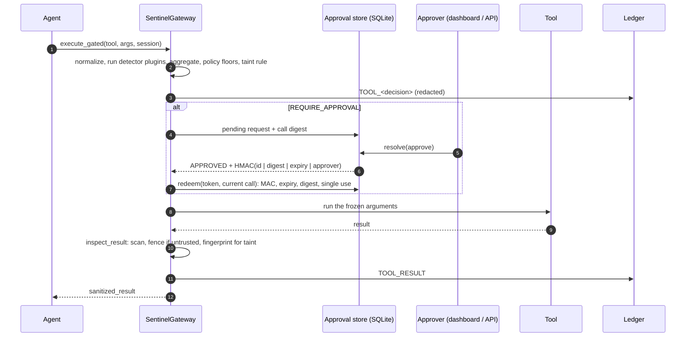

# Architecture and threat model

## Threat model

Sentinel assumes the **model is steerable** by anything in its context, whether that's the user, a web page, an email or a
file. It does not try to make the model trustworthy. It controls what the model's tool calls can do and what untrusted
data can reach.

| Threat | Where it's handled |
|---|---|
| Destructive or exfiltrating tool calls (`rm -r -f /`, `curl … \| sh`, `DROP DATABASE`) | Blast-radius detector (argv parsing), policy floors |
| Parameter tampering (traversal, SSRF, command substitution) | Argument validator (`ipaddress`, URL decoding to a fixed point, shlex) |
| Indirect prompt injection via tool **output** | Output guard + taint tracking |
| Evasion (Unicode, zero-width, double encoding, oversized input, ReDoS) | `sentinel.normalize` (NFKC, 64 KB cap), bounded regexes, detector time budget |
| Approving one thing and running another | Digest-bound, single-use HMAC approval tokens; `execute_gated` executes a frozen copy |
| Unauthorised approval, agents approving themselves | Separate agent / approver API keys, both fail closed |
| Log tampering, secrets in logs | HMAC-chained ledger with sequence + signed head; redaction before write |

Out of scope: a compromised host that holds the keys; semantic attacks with no lexical trace (paraphrased
exfiltration); correctness of the tools themselves.

## Request path

## Components

| Module | Responsibility |
|---|---|
| `sentinel/normalize.py` | The only place raw input is read: flattens nested args, NFKC plus zero-width stripping, URL-decodes up to 3 rounds, 64 KB cap (truncation is itself a signal), shell tokenisation. |
| `sentinel/detectors/` | Plugins registered under the `sentinel.detectors` entry-point group. Each takes the policy and returns a `DetectorFinding` for a `NormalizedCall`. `SCANS_OUTPUT = True` opts a detector into result scanning. |
| `sentinel/core/gateway.py` | Runs detectors (errors and budget overruns become SUSPICIOUS findings), aggregates with noisy-OR, applies policy floors (blocked, require-approval, unknown tool) and the taint rule, then writes to the ledger. Also contains `inspect_result` and `execute_gated`. |
| `sentinel/policies/*.yaml` | The single source of defaults. `PolicyConfig()` equals `default.yaml`, and custom files only override the keys they set. |
| `sentinel/taint.py` | Per-session 20-char shingle fingerprints of untrusted output, plus a "compromised" flag. |
| `sentinel/sandbox/approval.py` | SQLite approval store (WAL), digest binding, HMAC tokens, single-use redeem, polling waiters, webhook notifier. |
| `sentinel/sandbox/ledger.py` | HMAC chain over every record field, `seq`, signed `.head` checkpoint, `flock`, redaction. |
| `sentinel/server/app.py` | `create_app()`: intercept / poll / redeem (agent key), pending / resolve / audit (approver key), `/metrics`, health. |
| `sentinel/adapters/` | MCP proxy and OpenAI-style wrapper, both built on `execute_gated` and both checked by one contract test suite. |

## Scoring

Detector scores are 0–100 and are combined as independent evidence:
`1 − Π(1 − sᵢ/100)` (noisy-OR, or `max` via `policy.aggregation`). The score sets the tier (SAFE < 30 ≤ SUSPICIOUS < 70 ≤
CRITICAL by default). The policy can only make the decision stricter, never looser:

1. a blocked tool gives `BLOCK`
2. a require-approval tool gives at least `REQUIRE_APPROVAL`
3. an unknown tool gives at least `unknown_tool_action` (`REQUIRE_APPROVAL` or `BLOCK`)

## Keys

`SENTINEL_LEDGER_KEY` and `SENTINEL_APPROVAL_KEY` are HMAC keys, and `SENTINEL_AGENT_KEY` and `SENTINEL_APPROVER_KEY` are API
credentials. Without the HMAC env vars, random keys are created under `SENTINEL_HOME` (mode 0600) so local use needs no
setup. In production, inject them from a secret store so the processes writing logs and approvals can't read them.
Every process that resolves or redeems approvals must share `SENTINEL_APPROVAL_KEY`; otherwise the redeem step fails
closed. The MCP proxy strips all `SENTINEL_*` variables from the environment it passes to upstream servers.

## Known limits

- The detectors are heuristics. See `docs/BENCHMARKS.md` for measured rates and the misses.
- Taint tracking matches substrings, so paraphrased or re-encoded exfiltration gets through. It raises the bar and doesn't solve the problem.
- Approval waiters poll SQLite. Many API replicas or sub-100 ms approval latency would need Redis or Postgres notifications.
- Deleting both the ledger and its head file together goes undetected unless head checkpoints are shipped off-host.
- `flock` is POSIX-only, so there's no cross-process ledger lock on Windows.
